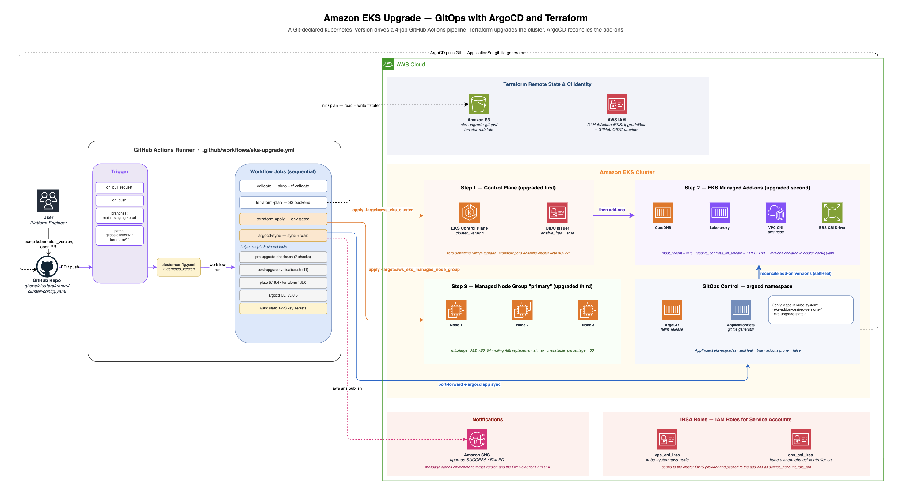

# Upgrade Amazon EKS clusters using GitOps and Argo CD

Manage Amazon EKS control plane and node group version upgrades declaratively, with the target Kubernetes version held in Git as the single source of truth.

A cluster's desired state lives in `gitops/clusters/<env>/cluster-config.yaml`. Changing `kubernetes_version` there, then applying Terraform, upgrades the control plane and rolls the managed node group. Argo CD watches the same file and reconciles the cluster's recorded desired state, so the version running in AWS and the version declared in Git converge instead of drifting. Two validation scripts gate the change: seven health checks before the upgrade, eleven assertions after it.

This sample provisions a complete working environment — VPC, EKS cluster, managed node group, IRSA roles, and Argo CD — so you can perform a real upgrade end to end.

---

## Table of contents

- [Architecture](#architecture)
- [How the upgrade works](#how-the-upgrade-works)
- [Repository structure](#repository-structure)
- [Prerequisites](#prerequisites)
- [Cost considerations](#cost-considerations)
- [Deployment](#deployment)
- [Performing an upgrade](#performing-an-upgrade)
- [Validation scripts](#validation-scripts)
- [Configuration reference](#configuration-reference)
- [Known limitations](#known-limitations)
- [Troubleshooting](#troubleshooting)
- [Cleanup](#cleanup)
- [Further reading](#further-reading)
- [Security](#security)
- [License](#license)

---

## Architecture



> **Note on the diagram.** It shows the full reference architecture, including a CI pipeline and notification topic. This repository contains the Terraform, GitOps manifests, and validation scripts. It does **not** include a CI workflow — see [Known limitations](#known-limitations). The Terraform does provision the GitHub OIDC provider and IAM role that such a pipeline would assume.

An upgrade touches three layers, in this order:

| Order | Layer | Upgraded by | Reference |
|---|---|---|---|
| 1 | EKS control plane | Terraform (`cluster_version`) | [Update the Kubernetes version](https://docs.aws.amazon.com/eks/latest/userguide/update-cluster.html) |
| 2 | EKS managed add-ons | Terraform (`cluster_addons`, tracking latest) | [Amazon EKS add-ons](https://docs.aws.amazon.com/eks/latest/userguide/eks-add-ons.html) |
| 3 | Managed node group kubelet | Terraform, rolling update at 33% max unavailable | [Update a managed node group](https://docs.aws.amazon.com/eks/latest/userguide/update-managed-node-group.html) |

This ordering is required: the control plane must lead, and nodes must not run a kubelet newer than the API server. See the Kubernetes [version skew policy](https://kubernetes.io/releases/version-skew-policy/) and the EKS [cluster upgrade best practices](https://docs.aws.amazon.com/eks/latest/best-practices/cluster-upgrades.html).

Argo CD runs alongside this. It reads every `cluster-config.yaml` through a [Git file generator](https://argo-cd.readthedocs.io/en/stable/operator-manual/applicationset/Generators-Git/) and renders the declared state into the cluster as ConfigMaps, giving you an in-cluster, continuously reconciled record of the intended version per environment.

**Services and tools:** Amazon EKS · Argo CD · Terraform · Amazon VPC · AWS IAM (IRSA + OIDC) · Amazon S3 (Terraform state) · Helm

<details>
<summary>Text version of the flow</summary>

```
Developer edits gitops/clusters/<env>/cluster-config.yaml
  kubernetes_version: "1.31" -> "1.32"
         │
         ├──────────────────────────────┐
         │                              │
         ▼                              ▼
  scripts/pre-upgrade-checks.sh    Argo CD git file generator
  (7 checks; blocks on failure)    detects the change
         │                              │
         ▼                              ▼
  terraform apply                  Renders desired-state ConfigMaps
    1. control plane                 into kube-system:
    2. EKS add-ons                   - eks-addon-desired-versions-<cluster>
    3. node group rolling update     - eks-upgrade-state-<cluster>
         │                              │
         └──────────────┬───────────────┘
                        ▼
         scripts/post-upgrade-validation.sh
         (11 assertions, incl. live DNS test)
```

</details>

---

## How the upgrade works

**Declared state.** Each environment has a `cluster-config.yaml` holding `kubernetes_version`, add-on versions, node group sizing, and metadata. It is a plain Kubernetes ConfigMap, which lets Argo CD's Git file generator consume it directly without extra tooling.

**Argo CD reconciliation.** Two [ApplicationSets](https://argo-cd.readthedocs.io/en/stable/operator-manual/applicationset/) share one generator over `gitops/clusters/*/cluster-config.yaml`, creating one Argo CD Application per environment automatically. Add a fourth cluster directory and its Applications appear without editing the ApplicationSets.

- `eks-cluster-addons` renders `gitops/addons` into `kube-system`, recording desired add-on versions. [`prune: false`](https://argo-cd.readthedocs.io/en/stable/user-guide/auto_sync/#automatic-pruning), so it never deletes add-on resources it did not create.
- `eks-upgrade-monitor` renders `gitops/upgrade-monitor` into `kube-system`, recording the target version. [Sync wave](https://argo-cd.readthedocs.io/en/stable/user-guide/sync-waves/) `1`, `prune: true`.

Both use [`selfHeal: true`](https://argo-cd.readthedocs.io/en/stable/user-guide/auto_sync/#automatic-self-healing) and [server-side apply](https://argo-cd.readthedocs.io/en/stable/user-guide/sync-options/#server-side-apply), and are scoped to the `eks-upgrades` [AppProject](https://argo-cd.readthedocs.io/en/stable/operator-manual/declarative-setup/#projects), which restricts sources to your GitOps repository only.

**Terraform-driven upgrade.** `terraform apply` performs the change that actually moves the cluster: EKS upgrades the control plane in place, then the managed node group rolls to a new [EKS-optimized AMI](https://docs.aws.amazon.com/eks/latest/userguide/eks-optimized-ami.html) at no more than 33% unavailable at a time. Add-ons use `resolve_conflicts_on_update = "PRESERVE"` so your customizations survive.

**Validation.** The scripts are standalone and take configuration from environment variables, so they work equally well from a laptop or a CI job.

---

## Repository structure

```
.
├── terraform/
│   ├── main.tf                  # Providers, S3 backend, common tags
│   ├── vpc.tf                   # VPC 10.0.0.0/16, 3 public + 3 private subnets
│   ├── eks.tf                   # EKS cluster, add-ons, node group, IRSA roles
│   ├── argocd.tf                # Argo CD Helm release + eks-upgrades AppProject
│   ├── iam.tf                   # GitHub OIDC provider + CI role
│   ├── variables.tf             # Inputs, with validation
│   ├── outputs.tf               # Cluster endpoint, role ARNs, kubeconfig command
│   └── environments/            # Per-environment tfvars (dev / staging / prod)
├── gitops/
│   ├── clusters/                # Desired state — edit these to drive an upgrade
│   │   ├── dev/cluster-config.yaml
│   │   ├── staging/cluster-config.yaml
│   │   └── prod/cluster-config.yaml
│   ├── applicationsets/
│   │   ├── cluster-addons.yaml            # ApplicationSet: add-on versions
│   │   └── cluster-upgrade-monitor.yaml   # ApplicationSet: upgrade state
│   ├── addons/                  # Helm chart: desired add-on version ConfigMap
│   └── upgrade-monitor/         # Helm chart: upgrade state ConfigMap
└── scripts/
    ├── pre-upgrade-checks.sh        # 7 pre-flight health checks
    └── post-upgrade-validation.sh   # 11 post-upgrade assertions
```

---

## Prerequisites

- An AWS account with permissions to create VPCs, EKS clusters, IAM roles, OIDC providers, and S3 buckets
- A fork of this repository, which Argo CD will read from
- Local tooling:
  - [Terraform](https://developer.hashicorp.com/terraform/install) ≥ 1.6 — required for S3 native state locking
  - [AWS CLI v2](https://docs.aws.amazon.com/cli/latest/userguide/getting-started-install.html), configured with credentials
  - [kubectl](https://kubernetes.io/docs/tasks/tools/), within one minor version of your cluster per the [version skew policy](https://kubernetes.io/releases/version-skew-policy/)
  - [Helm 3](https://helm.sh/docs/intro/install/)
  - [Argo CD CLI](https://argo-cd.readthedocs.io/en/stable/cli_installation/) (optional, for repository registration)
  - [pluto](https://github.com/FairwindsOps/pluto) (optional) — without it, the pre-upgrade deprecated-API scan is skipped with a warning rather than failing

---

## Cost considerations

Deploying this sample creates billable resources in your AWS account. The main contributors:

| Resource | Notes |
|---|---|
| EKS control plane | Per-cluster hourly charge, billed while the cluster exists |
| EC2 instances | 3 × `m5.xlarge` by default (`desired_size = 3`) |
| NAT gateway | One shared gateway (`single_nat_gateway = true`), hourly plus data processing |
| Load balancer | Provisioned for the Argo CD server `Service` |
| EBS volumes, S3, data transfer | Node root volumes, Terraform state, egress |

The node group typically dominates. To reduce cost while testing, lower `node_group_desired_size` and use a smaller instance type in your tfvars. Consult the [EKS](https://aws.amazon.com/eks/pricing/), [EC2](https://aws.amazon.com/ec2/pricing/), and [VPC](https://aws.amazon.com/vpc/pricing/) pricing pages for current rates in your Region, and [clean up](#cleanup) when finished.

---

## Deployment

### 1. Fork the repository and set your repository URL

Argo CD pulls manifests over HTTPS, so it needs a URL it can reach. The repository ships with a `<your-org>` placeholder that must be replaced in five files:

```bash
git clone https://github.com/<your-org>/eks-upgrade-gitops-argocd.git
cd eks-upgrade-gitops-argocd

# Substitute your org or user in the ApplicationSets and all three tfvars
grep -rl '<your-org>' gitops/ terraform/environments/ \
  | xargs sed -i.bak "s|<your-org>|YOUR_ORG|g" && find . -name '*.bak' -delete
```

Also update the CI trust condition in `terraform/iam.tf`, which is pinned to the upstream sample repository:

```hcl
values = ["repo:<your-org>/eks-upgrade-gitops-argocd:*"]
```

Leaving it unchanged means no workflow in *your* repository can assume the role.

### 2. Create the Terraform state bucket

```bash
# Use a globally-unique name — include your account ID or a random suffix
export STATE_BUCKET="my-tf-state-eks-upgrades-<account-id>"   # replace <account-id>
export AWS_REGION="us-east-1"

aws s3api create-bucket --bucket "$STATE_BUCKET" --region "$AWS_REGION"

aws s3api put-bucket-versioning \
  --bucket "$STATE_BUCKET" \
  --versioning-configuration Status=Enabled

aws s3api put-public-access-block \
  --bucket "$STATE_BUCKET" \
  --public-access-block-configuration \
    "BlockPublicAcls=true,IgnorePublicAcls=true,BlockPublicPolicy=true,RestrictPublicBuckets=true"
```

[State locking](https://developer.hashicorp.com/terraform/language/state/locking) uses S3 native locking (`use_lockfile = true`), so no DynamoDB table is required. See the [S3 backend reference](https://developer.hashicorp.com/terraform/language/backend/s3) for all supported options, and [S3 versioning](https://docs.aws.amazon.com/AmazonS3/latest/userguide/Versioning.html) for why versioning matters on a state bucket.

> For Regions other than `us-east-1`, add `--create-bucket-configuration LocationConstraint="$AWS_REGION"`.

### 3. Deploy the cluster

```bash
cd terraform/
cp environments/dev.tfvars terraform.tfvars
# Edit terraform.tfvars: set gitops_repo_url to your fork
```

`main.tf` ships no bucket name, so supply yours at init time rather than editing the file. `terraform init` fails without it:

```bash
terraform init -backend-config="bucket=$STATE_BUCKET" -backend-config="region=$AWS_REGION"
terraform plan
terraform apply
```

Provisioning the VPC, cluster, node group, add-ons, and Argo CD takes roughly 15–20 minutes.

### 4. Configure kubectl

```bash
# outputs.tf emits the exact command for your cluster
terraform output -raw configure_kubectl

aws eks update-kubeconfig --region us-east-1 --name my-eks-cluster
kubectl get nodes
```

See [`aws eks update-kubeconfig`](https://docs.aws.amazon.com/cli/latest/reference/eks/update-kubeconfig.html) for additional flags such as `--alias` and `--role-arn`.

### 5. Register the repository with Argo CD

Terraform installs Argo CD and creates the `eks-upgrades` AppProject. Retrieve the admin password and open a port-forward:

```bash
kubectl get secret argocd-initial-admin-secret -n argocd \
  -o jsonpath="{.data.password}" | base64 -d; echo

kubectl port-forward svc/argocd-server -n argocd 8080:80 &
argocd login localhost:8080 --username admin --plaintext
```

A public fork needs no credentials. For a private fork, supply a token scoped to read that repository only:

```bash
argocd repo add https://github.com/<your-org>/eks-upgrade-gitops-argocd \
  --username not-used --password "$GITHUB_TOKEN"
```

### 6. Apply the ApplicationSets

```bash
kubectl apply -f gitops/applicationsets/cluster-addons.yaml
kubectl apply -f gitops/applicationsets/cluster-upgrade-monitor.yaml

# One Application per cluster-config.yaml should appear
kubectl get applications -n argocd
```

Verify the desired-state ConfigMaps were rendered:

```bash
kubectl get configmap -n kube-system | grep -E 'eks-addon-desired-versions|eks-upgrade-state'
```

---

## Performing an upgrade

Amazon EKS supports one minor version at a time. Going from 1.30 to 1.32 means 1.30 → 1.31 → 1.32, and both the Terraform variable validation and `pre-upgrade-checks.sh` enforce this. Before picking a target, check which versions are currently available and where they sit in the support lifecycle: [Kubernetes versions](https://docs.aws.amazon.com/eks/latest/userguide/kubernetes-versions.html), [standard and extended support](https://docs.aws.amazon.com/eks/latest/userguide/kubernetes-versions-standard.html), and [EKS platform versions](https://docs.aws.amazon.com/eks/latest/userguide/platform-versions.html).

[Cluster insights](https://docs.aws.amazon.com/eks/latest/userguide/cluster-insights.html) is worth running first as well. EKS checks your cluster for known upgrade blockers and reports them against the next version.

**1. Run the pre-upgrade checks.**

```bash
export CLUSTER_NAME="my-eks-cluster"
export TARGET_VERSION="1.32"
export AWS_REGION="us-east-1"

./scripts/pre-upgrade-checks.sh
```

A non-zero exit means something would make the upgrade unsafe. Resolve it before continuing.

**2. Update the declared version.** On a branch, edit `gitops/clusters/dev/cluster-config.yaml`:

```yaml
data:
  kubernetes_version: "1.32"                    # was "1.31"
  kube_proxy_version: "v1.32.13-eksbuild.24"    # match the new minor version
  coredns_version: "v1.11.4-eksbuild.51"
```

Add-on versions compatible with a given Kubernetes version are listed by [`aws eks describe-addon-versions`](https://docs.aws.amazon.com/cli/latest/reference/eks/describe-addon-versions.html):

```bash
aws eks describe-addon-versions \
  --addon-name kube-proxy --kubernetes-version 1.32 \
  --query 'addons[].addonVersions[].addonVersion' --output table
```

Per-add-on guidance: [CoreDNS](https://docs.aws.amazon.com/eks/latest/userguide/managing-coredns.html), [kube-proxy](https://docs.aws.amazon.com/eks/latest/userguide/managing-kube-proxy.html), [Amazon VPC CNI](https://docs.aws.amazon.com/eks/latest/userguide/managing-vpc-cni.html), [EBS CSI driver](https://docs.aws.amazon.com/eks/latest/userguide/ebs-csi.html).

**3. Review and merge.** Open a pull request so the version change is reviewed like any other code change. This is the audit point for the upgrade.

**4. Apply.** Set the same version in your tfvars, then:

```bash
cd terraform/
terraform plan    # expect cluster_version and node group AMI changes only
terraform apply
```

The control plane upgrades first, then add-ons, then the node group rolls. Argo CD independently reconciles the merged `cluster-config.yaml` into the desired-state ConfigMaps.

**5. Validate.**

```bash
export CLUSTER_NAME="my-eks-cluster"
export EXPECTED_VERSION="1.32"
export AWS_REGION="us-east-1"

./scripts/post-upgrade-validation.sh
```

Promote through `dev` → `staging` → `prod`, validating at each stage.

---

## Validation scripts

Both scripts read environment variables, print a per-check `[PASS]`/`[FAIL]`/`[WARN]` line, and exit non-zero if any check fails — suitable as a CI gate.

**`pre-upgrade-checks.sh`** — requires `CLUSTER_NAME`, `TARGET_VERSION`; `AWS_REGION` defaults to `us-east-1`.

| # | Check | On problem |
|---|---|---|
| 1 | Cluster status is `ACTIVE` | Fail |
| 2 | Upgrade is a single minor increment | Fail (warns if already at target) |
| 3 | All nodes `Ready` | Fail |
| 4 | No [PodDisruptionBudget](https://kubernetes.io/docs/tasks/run-application/configure-pdb/) would block a drain | Fail |
| 5 | No APIs removed in the target version (needs [`pluto`](https://github.com/FairwindsOps/pluto)) | Fail, or warn if `pluto` absent |
| 6 | No pods outside `Running`/`Succeeded` | Warn |
| 7 | Argo CD pods healthy | Fail, or warn if namespace absent |

**`post-upgrade-validation.sh`** — requires `CLUSTER_NAME`, `EXPECTED_VERSION`; `AWS_REGION` defaults to `us-east-1`. Six groups, eleven assertions:

| # | Check |
|---|---|
| 1 | Control plane reports the expected version |
| 2 | All nodes `Ready`, kubelet minor version matches |
| 3 | All `kube-system` pods `Running`/`Succeeded` |
| 4 | All four EKS add-ons `ACTIVE` (one assertion each) |
| 5 | Argo CD pods healthy and the upgrade-state ConfigMap matches |
| 6 | Live DNS resolution test |

Check 6 creates a short-lived `busybox` pod in `default` to resolve `kubernetes.default.svc.cluster.local`, then removes it via an `EXIT` trap. A node group rolling update still in progress surfaces as a kubelet-version warning in check 2 rather than a hard failure.

For check 5, the Kubernetes [deprecated API migration guide](https://kubernetes.io/docs/reference/using-api/deprecation-guide/) lists what each release removes, which is the authoritative companion to `pluto`'s output.

---

## Configuration reference

Full descriptions live in `terraform/variables.tf`.

| Variable | Default | Purpose |
|---|---|---|
| `cluster_name` | *(required)* | Cluster name, used as a resource prefix |
| `gitops_repo_url` | *(required)* | HTTPS URL of your fork; scopes the AppProject |
| `kubernetes_version` | `1.32` | Target version. Validated against `1.28`–`1.39` |
| `environment` | `dev` | One of `dev`, `staging`, `prod` |
| `aws_region` | `us-east-1` | Deployment Region |
| `vpc_id` | `""` | Reuse an existing VPC; empty creates one |
| `private_subnet_ids` | `[]` | Reuse existing subnets; empty uses the created VPC |
| `node_group_instance_types` | `["m5.xlarge"]` | Node group instance types |
| `node_group_min_size` / `desired` / `max` | `2` / `3` / `6` | Node group sizing |
| `argocd_version` | `7.3.11` | `argo-cd` Helm chart version |
| `argocd_namespace` | `argocd` | Argo CD namespace |

Pinned module versions, each linked to its registry documentation: [`eks/aws` **20.36.0**](https://registry.terraform.io/modules/terraform-aws-modules/eks/aws/20.36.0), [`vpc/aws` **5.13.0**](https://registry.terraform.io/modules/terraform-aws-modules/vpc/aws/5.13.0), [`iam/aws` **5.44.0**](https://registry.terraform.io/modules/terraform-aws-modules/iam/aws/5.44.0). Argo CD is installed from the [`argo-cd` Helm chart](https://github.com/argoproj/argo-helm/releases).

The VPC spans three Availability Zones with one shared NAT gateway, and carries the `kubernetes.io/role/elb` and `kubernetes.io/cluster/<name>` subnet tags that EKS needs for load balancer and node placement. See [VPC requirements for EKS](https://docs.aws.amazon.com/eks/latest/userguide/network-reqs.html) and [subnet requirements](https://docs.aws.amazon.com/eks/latest/userguide/creating-a-vpc.html) if you supply your own `vpc_id`.

The VPC CNI and EBS CSI add-ons authenticate through [IAM roles for service accounts (IRSA)](https://docs.aws.amazon.com/eks/latest/userguide/iam-roles-for-service-accounts.html) rather than node instance profiles.

---

## Known limitations

Read these before adapting the sample.

**No CI workflow is included.** `iam.tf` provisions the GitHub OIDC provider and the `GitHubActionsEKSUpgradeRole`, and `outputs.tf` exposes its ARN as `github_actions_role_arn`, but there is no `.github/workflows/` directory. The upgrade flow above is therefore run manually. To automate it, add a workflow that assumes the role via OIDC and calls the scripts and Terraform in order, following [Configuring OpenID Connect in Amazon Web Services](https://docs.github.com/en/actions/deployment/security-hardening-your-deployments/configuring-openid-connect-in-amazon-web-services). Use OIDC role assumption rather than long-lived `AWS_ACCESS_KEY_ID`/`AWS_SECRET_ACCESS_KEY` secrets, which is what the provisioned role exists for.

**Argo CD records add-on versions; Terraform sets them.** The `gitops/addons` chart renders a ConfigMap of desired versions. It does not call the EKS API, so it does not itself change deployed add-ons. Actual add-on versions come from the `cluster_addons` block in `eks.tf`, which uses `most_recent = true`. The pinned versions in `cluster-config.yaml` are consequently a *record* of intent rather than the effective source of truth, and the two can diverge. To make Git authoritative, pass those values into Terraform's `cluster_addons` as `addon_version` and drop `most_recent`.

**The CI role's S3 permissions may not match the backend bucket.** `iam.tf` grants access to `${var.cluster_name}-tf-state`, while the backend bucket is whatever you pass to `terraform init -backend-config="bucket=..."`. Align them before wiring up CI.

**The CI role carries unused DynamoDB permissions.** A `TerraformStateLock` statement grants access to a `terraform-state-lock` table, left over from DynamoDB-based locking. This configuration uses S3 native locking, so the statement can be removed.

**Argo CD is served without TLS.** `argocd.tf` sets `--insecure` and `server.insecure = true` behind a `LoadBalancer`. Acceptable when TLS terminates at the load balancer or ingress; for production, follow the Argo CD [TLS configuration guide](https://argo-cd.readthedocs.io/en/stable/operator-manual/tls/), for example with [cert-manager](https://cert-manager.io/docs/).

**The cluster API endpoint is public.** `cluster_endpoint_public_access = true`. Restrict the allowed CIDRs or disable public access for production clusters — see [cluster endpoint access control](https://docs.aws.amazon.com/eks/latest/userguide/cluster-endpoint.html).

**Node group sizing is declared in two places.** `cluster-config.yaml` carries `node_group_*` values, but Terraform reads sizing from its own variables. Only the Terraform values take effect.

---

## Troubleshooting

**Applications do not appear after applying the ApplicationSets.** Usually an unreplaced `<your-org>` placeholder, or a repository Argo CD cannot reach.

```bash
kubectl logs -n argocd deploy/argocd-applicationset-controller --tail=50
kubectl get applicationset -n argocd -o yaml | grep repoURL
```

**Application health is `Unknown` or sync fails with a project error.** The AppProject restricts sources to `gitops_repo_url`. If the ApplicationSet `repoURL` and that variable disagree, Argo CD refuses the sync.

```bash
kubectl get appproject eks-upgrades -n argocd -o jsonpath='{.spec.sourceRepos}'
```

**`terraform apply` reports the version is unsupported.** Confirm the target is available in your Region, and that you are moving exactly one minor version:

```bash
aws eks describe-cluster --name "$CLUSTER_NAME" --query 'cluster.version'
aws eks describe-addon-versions --kubernetes-version 1.32 --query 'addons[0]' >/dev/null
```

**Node group update stalls.** Almost always a PodDisruptionBudget that cannot be satisfied, which check 4 of the pre-upgrade script is designed to catch:

```bash
kubectl get pdb -A
aws eks describe-update --name "$CLUSTER_NAME" --nodegroup-name primary --update-id <id>
```

**Post-upgrade check 2 warns about kubelet versions.** The rolling update is still running. Re-run once it finishes:

```bash
kubectl get nodes -o custom-columns=NAME:.metadata.name,KUBELET:.status.nodeInfo.kubeletVersion
```

**Terraform cannot acquire a state lock.** A previous run exited uncleanly. Confirm nothing else is applying before forcing the lock, then [`terraform force-unlock <lock-id>`](https://developer.hashicorp.com/terraform/cli/commands/force-unlock).

---

## Cleanup

Delete in this order. Removing the Argo CD `Service` before the VPC lets the load balancer detach cleanly, avoiding a dependency violation on subnet deletion.

```bash
# 1. Remove Argo CD Applications and ApplicationSets
kubectl delete -f gitops/applicationsets/ --ignore-not-found

# 2. Destroy all Terraform-managed infrastructure, Argo CD release included
cd terraform/
terraform destroy

# 3. Empty and delete the state bucket (versioned buckets need versions purged)
aws s3api delete-objects --bucket "$STATE_BUCKET" \
  --delete "$(aws s3api list-object-versions --bucket "$STATE_BUCKET" \
    --query '{Objects: Versions[].{Key:Key,VersionId:VersionId}}' --output json)" 2>/dev/null

aws s3api delete-bucket --bucket "$STATE_BUCKET" --region "$AWS_REGION"
```

Confirm nothing chargeable remains:

```bash
aws eks list-clusters --region "$AWS_REGION"
aws ec2 describe-nat-gateways --region "$AWS_REGION" \
  --filter Name=state,Values=available --query 'NatGateways[].NatGatewayId'
aws elb describe-load-balancers --region "$AWS_REGION" --query 'LoadBalancerDescriptions[].LoadBalancerName'
aws elbv2 describe-load-balancers --region "$AWS_REGION" --query 'LoadBalancers[].LoadBalancerName'
```

If `terraform destroy` leaves orphaned resources, an Argo CD-managed resource is usually still holding a finalizer. Remove the Applications first, then re-run.

---

## Further reading

**Upgrading Amazon EKS**

- [Update an Amazon EKS cluster Kubernetes version](https://docs.aws.amazon.com/eks/latest/userguide/update-cluster.html) — control plane upgrade mechanics and prerequisites
- [Best practices for cluster upgrades](https://docs.aws.amazon.com/eks/latest/best-practices/cluster-upgrades.html) — the EKS Best Practices Guide chapter this sample is modelled on
- [Cluster insights](https://docs.aws.amazon.com/eks/latest/userguide/cluster-insights.html) — automated upgrade readiness checks
- [Update a managed node group](https://docs.aws.amazon.com/eks/latest/userguide/update-managed-node-group.html) and [managed node groups](https://docs.aws.amazon.com/eks/latest/userguide/managed-node-groups.html)
- [Kubernetes versions](https://docs.aws.amazon.com/eks/latest/userguide/kubernetes-versions.html), [standard and extended support](https://docs.aws.amazon.com/eks/latest/userguide/kubernetes-versions-standard.html), [platform versions](https://docs.aws.amazon.com/eks/latest/userguide/platform-versions.html)
- [Kubernetes version skew policy](https://kubernetes.io/releases/version-skew-policy/) and [deprecated API migration guide](https://kubernetes.io/docs/reference/using-api/deprecation-guide/)

**Amazon EKS add-ons**

- [Amazon EKS add-ons](https://docs.aws.amazon.com/eks/latest/userguide/eks-add-ons.html)
- [CoreDNS](https://docs.aws.amazon.com/eks/latest/userguide/managing-coredns.html) · [kube-proxy](https://docs.aws.amazon.com/eks/latest/userguide/managing-kube-proxy.html) · [Amazon VPC CNI](https://docs.aws.amazon.com/eks/latest/userguide/managing-vpc-cni.html) · [EBS CSI driver](https://docs.aws.amazon.com/eks/latest/userguide/ebs-csi.html)
- [EKS-optimized Amazon Linux AMIs](https://docs.aws.amazon.com/eks/latest/userguide/eks-optimized-ami.html)

**Argo CD and GitOps**

- [ApplicationSet controller](https://argo-cd.readthedocs.io/en/stable/operator-manual/applicationset/) and the [Git generator](https://argo-cd.readthedocs.io/en/stable/operator-manual/applicationset/Generators-Git/)
- [Automated sync, pruning, and self-healing](https://argo-cd.readthedocs.io/en/stable/user-guide/auto_sync/) · [sync options](https://argo-cd.readthedocs.io/en/stable/user-guide/sync-options/) · [sync waves](https://argo-cd.readthedocs.io/en/stable/user-guide/sync-waves/)
- [Declarative setup and AppProjects](https://argo-cd.readthedocs.io/en/stable/operator-manual/declarative-setup/#projects)
- [TLS configuration](https://argo-cd.readthedocs.io/en/stable/operator-manual/tls/) and [upgrading Argo CD](https://argo-cd.readthedocs.io/en/stable/operator-manual/upgrading/overview/)

**Terraform**

- Modules used here: [`eks/aws`](https://registry.terraform.io/modules/terraform-aws-modules/eks/aws/20.36.0) · [`vpc/aws`](https://registry.terraform.io/modules/terraform-aws-modules/vpc/aws/5.13.0) · [`iam/aws`](https://registry.terraform.io/modules/terraform-aws-modules/iam/aws/5.44.0)
- [S3 backend](https://developer.hashicorp.com/terraform/language/backend/s3) and [state locking](https://developer.hashicorp.com/terraform/language/state/locking)

**Security and networking**

- [IAM roles for service accounts](https://docs.aws.amazon.com/eks/latest/userguide/iam-roles-for-service-accounts.html)
- [Cluster endpoint access control](https://docs.aws.amazon.com/eks/latest/userguide/cluster-endpoint.html)
- [VPC and subnet requirements](https://docs.aws.amazon.com/eks/latest/userguide/network-reqs.html)
- [Configuring OpenID Connect in AWS for GitHub Actions](https://docs.github.com/en/actions/deployment/security-hardening-your-deployments/configuring-openid-connect-in-amazon-web-services)
- [Resilience in Amazon EKS](https://docs.aws.amazon.com/eks/latest/userguide/disaster-recovery-resiliency.html)

---

## Security

This is sample code, intended for learning and adaptation rather than direct production use. Before production, address the public API endpoint, Argo CD TLS, and the IAM findings in [Known limitations](#known-limitations), and scope the CI role's trust condition to your own repository.

The OIDC thumbprints in `iam.tf` are GitHub's public certificate fingerprints, not secrets.

To report a potential security issue, see [CONTRIBUTING](CONTRIBUTING.md#security-issue-notifications). Please do not open a public issue.

## License

Licensed under the MIT-0 License. See [LICENSE](LICENSE).
